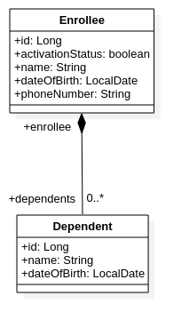
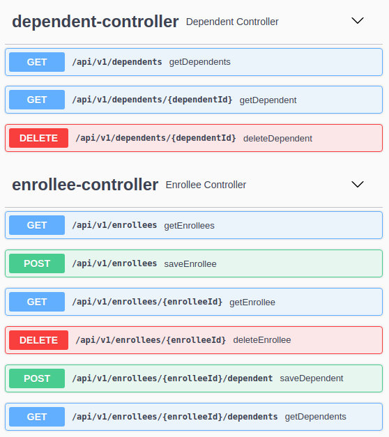
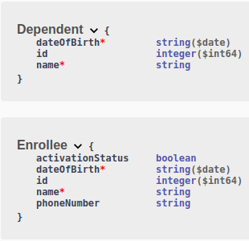

### Challenge Requirements

Using Spring Boot or Go, and your database of choice (PostgreSQL, MySQL, MongoDB -- any you'd like), develop a microservice for tracking the status of enrollees in a health care program.
- Enrollees must have an id, name, and activation status (true or false), and a birth date
- Enrollees may have a phone number (although they do not have to supply this)
- Enrollees may have zero or more dependents
- Each of an enrollee's dependents must have an id, name, and birth date

The application we will be building will need to be able to do these things:
- Add a new enrollee
- Modify an existing enrollee
- Remove an enrollee entirely
- Add dependents to an enrollee
- Remove dependents from an enrollee
- Modify existing dependents

#### Build
mvnw clean install
or
mvn clean install

#### Run with test data
java -jar target/challenge-0.0.1-SNAPSHOT.jar --CreateTestData

#### Create docker image and start container
./docker.sh

#### Clean out the docker container and image
./docker-rm.sh

### Entity Class Diagram

### Rest End Points Swagger Snapshot
http://localhost:8084/swagger-ui/index.html

### Rest End Points Schema

### Reference Documentation
For further reference, please consider the following sections:

* [Official Apache Maven documentation](https://maven.apache.org/guides/index.html)
* [Spring Boot Maven Plugin Reference Guide](https://docs.spring.io/spring-boot/docs/2.3.3.RELEASE/maven-plugin/reference/html/)
* [Create an OCI image](https://docs.spring.io/spring-boot/docs/2.3.3.RELEASE/maven-plugin/reference/html/#build-image)
* [Spring Data JPA](https://docs.spring.io/spring-boot/docs/2.3.3.RELEASE/reference/htmlsingle/#boot-features-jpa-and-spring-data)
* [Rest Repositories](https://docs.spring.io/spring-boot/docs/2.3.3.RELEASE/reference/htmlsingle/#howto-use-exposing-spring-data-repositories-rest-endpoint)

### Guides
The following guides illustrate how to use some features concretely:

* [Accessing Data with JPA](https://spring.io/guides/gs/accessing-data-jpa/)
* [Accessing JPA Data with REST](https://spring.io/guides/gs/accessing-data-rest/)

